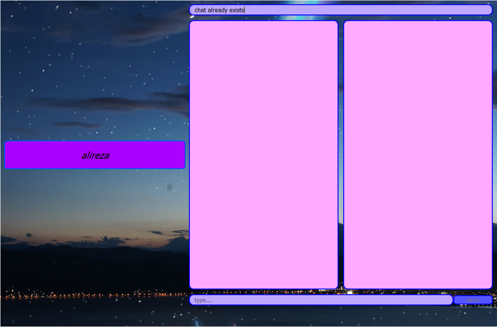

# Tokyo_Messenger
<p  align="center"> <b>Advanced Programming course Project - Spring 2022 Semester</b> </p>
<br>
<p align="center">

</p>
<br>

<p align="center">

</p>
<br>

# How to install

## Server
### First of all you should using Docker to have your Django server
```docker
docker-compose up --build
```

# Contribute
### Mohammadreza babaei
### Alireza Abdollahpourrostam
### Mohammad mahdi sharifian


